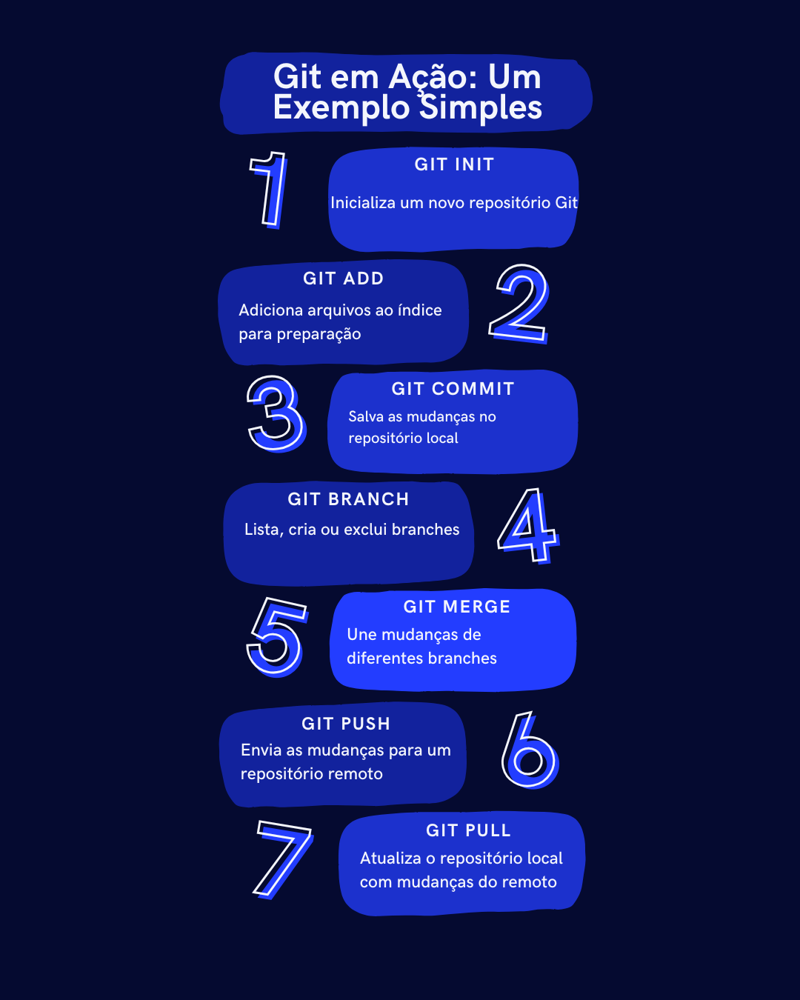
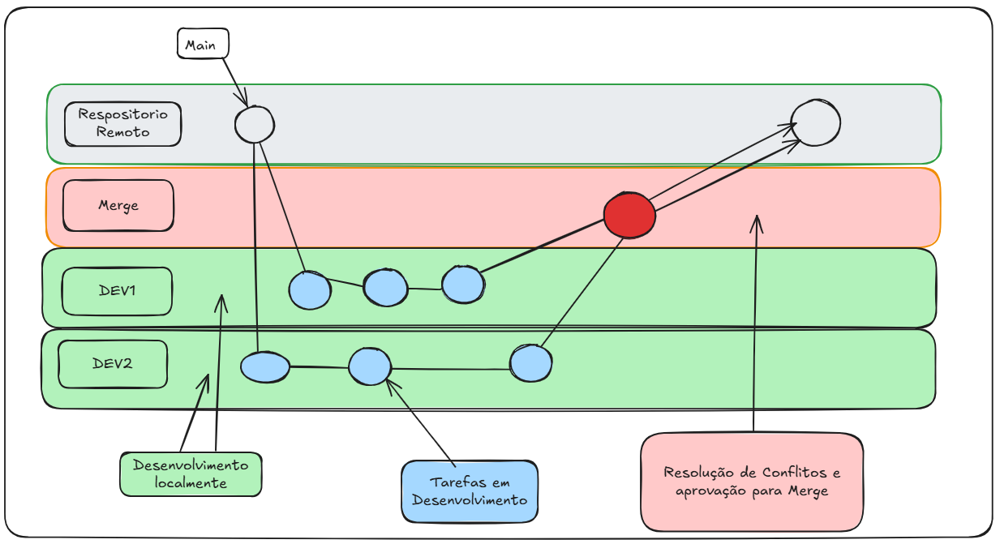

# 🚀 git-introduction  

## 🎯 Objetivo 
Este repositório tem por objetivo introduzir o uso do Git para alunos iniciantes na área de tecnologia, proporcionando uma abordagem simples e prática para a assimilação desse conhecimento.

# 🎨 Introdução ao Git e GitLab  

## 📌 O que é o Git?  

O **Git** é um sistema de controle de versão distribuído que permite rastrear mudanças no código, colaborar com equipes e gerenciar projetos de maneira eficiente. Ele armazena um histórico completo das alterações, o que facilita o controle e a recuperação de versões anteriores do código. 

Além disso, o Git é uma ferramenta crucial em equipes de desenvolvimento, pois possibilita não apenas acessar o código de outros colaboradores, mas também manter um histórico detalhado dos arquivos e das modificações feitas neles. Cada conjunto de mudanças é agrupado em um "commit", permitindo voltar no tempo, recuperar estados anteriores do sistema, identificar bugs e analisar otimizações.

## ⚙️ Funcionamento do Git:

Todos os arquivos e seus históricos são armazenados em um repositório. Existem outros sistemas de gerenciamento de repositórios, como CVS e SVN, mas o Git se destaca por ser distribuído: cada colaborador possui uma cópia completa do repositório, não apenas um servidor principal. Isso possibilita o desenvolvimento offline, com a realização de commits e outras operações sem a necessidade de conexão constante com um servidor central.

O Git é um sistema de controle de versão distribuído, amplamente utilizado, que superou outros sistemas de controle de versões devido à sua eficiência e flexibilidade.

## 📄 Por que usar o Git?

Imagine que você tem uma equipe de 5 desenvolvedores trabalhando juntos em um projeto. Todos vão mexer no mesmo código, o que pode causar alguns problemas. O Git é uma ferramenta que ajuda a resolver essas questões, permitindo que cada um trabalhe de maneira independente e depois combine suas alterações.

## 🔧 O que o Git faz?

1. **Armazenamento do código**: O Git armazena o código de forma organizada, em um lugar chamado "repositório". Isso garante que todos na equipe tenham acesso à versão mais atualizada do código.

2. **Trabalho em equipe**: Cada desenvolvedor pode fazer alterações no código ao mesmo tempo, sem atrapalhar o trabalho dos outros. Quando alguém faz mudanças, essas alterações são salvas no repositório, e cada um pode pegar as últimas versões a qualquer momento.

3. **Versões do código**: O Git mantém um histórico de todas as mudanças feitas no código, ou seja, ele cria versões do código. Se algo der errado, você pode voltar facilmente para uma versão anterior e corrigir problemas.

4. **Merge (Mesclagem)**: Às vezes, dois desenvolvedores podem mexer na mesma parte do código ao mesmo tempo. Quando isso acontece, o Git tenta juntar as mudanças automaticamente, no processo chamado "merge" (mesclagem). Se não conseguir juntar de forma automática, ele avisa para o desenvolvedor resolver o conflito. Isso é importante para evitar que as mudanças de um desenvolvedor sobrescrevam as de outro.

5. **Conflitos de versão**: O Git ajuda a identificar quando duas alterações entram em conflito. Ou seja, se duas pessoas tentarem modificar a mesma linha de código, o Git vai pedir para que um dos desenvolvedores escolha qual mudança manter. Isso é chamado de "conflito de versões". Resolver esses conflitos é parte do trabalho em equipe.

## 📝 Resumo

O Git facilita o trabalho em equipe, permitindo que todos os desenvolvedores mexam no código sem perder nada. Ele mantém o código seguro e organizado, e ajuda a evitar problemas quando várias pessoas trabalham ao mesmo tempo.

## 🔍 Diferença entre GitHub e GitLab:

1. **Git:** 
   - É um sistema de controle de versões distribuído que permite que múltiplas pessoas trabalhem em um projeto simultaneamente, rastreando alterações no código ao longo do tempo. Git é uma ferramenta que pode ser usada localmente em um computador ou em servidores.

2. **GitHub:**
   - É uma plataforma de hospedagem de código-fonte que utiliza o Git como sistema de controle de versões. Oferece uma interface web, integração com diversas ferramentas, funcionalidades sociais como pull requests, e suporte a colaboração em projetos. GitHub é amplamente utilizado na comunidade de desenvolvimento de software e é conhecido por seus recursos de código aberto.

3. **GitLab:**
   - Também é uma plataforma de hospedagem de código-fonte que utiliza o Git. Além das funcionalidades semelhantes ao GitHub, o GitLab oferece uma integração mais profunda com ferramentas de DevOps, como CI/CD (Integração Contínua e Entrega Contínua), gestão de projetos e monitoramento. GitLab pode ser instalado em servidores próprios, oferecendo mais controle sobre a infraestrutura.

## ⚠️ Observação:

Git e GitHub não são a mesma coisa. Git é a tecnologia de controle de versões, enquanto GitHub e GitLab são plataformas que facilitam o uso do Git, oferecendo recursos adicionais para colaboração e gerenciamento de projetos.

## 🛠️ Principais Conceitos do Git de maneira simples e eficas:

1. **Repositório**: É como uma pasta mágica onde todo o seu código e histórico de mudanças ficam armazenados. Pode ser local (no seu computador) ou remoto (na internet, como no GitHub).

2. **Commit**: Imagine que você está escrevendo um livro. Cada vez que termina um capítulo ou uma parte importante, você faz um "commit", que é como salvar aquele estado do livro. Você pode ver todos os capítulos anteriores e até voltar para um deles se precisar.

3. **Branch (Ramo)**: Pense em uma árvore. O tronco principal é a linha principal do seu projeto (o branch principal, geralmente chamado "main" ou "master"). Os galhos (branches) são versões paralelas do seu projeto, onde você pode fazer experimentos ou adicionar novas funcionalidades sem mexer no tronco principal.

4. **Merge (Mesclar)**: Quando um galho (branch) está pronto e você quer juntar ele ao tronco principal, você faz um "merge". É como pegar aquele novo galho que cresceu e conectá-lo de volta ao tronco principal.

5. **Clone**: Se você quiser uma cópia completa de um repositório remoto no seu computador, você faz um "clone". É como pegar um livro da biblioteca para ler em casa.

6. **Push e Pull**: 
   - **Push**: Quando você terminou suas alterações e quer enviar essas mudanças do seu repositório local para o repositório remoto (na internet), você faz um "push".
   - **Pull**: Quando você quer pegar as últimas alterações do repositório remoto e trazê-las para o seu repositório local, você faz um "pull".

7. **Staging Area (Área de Preparação)**: É uma etapa intermediária onde você pode selecionar exatamente quais mudanças deseja incluir no seu próximo commit. Pense nisso como preparar os ingredientes na bancada antes de cozinhar.

## 🌟 Git em Ação: Um Exemplo Simples

## 🌟 Fluxo de desenvolvimento em Ação: Um Exemplo Simples

# 📖 Documentações Uteis

Aqui estão alguns guias úteis com comandos, iniciando com projetos pessoais e etc:  

🚀 [Como iniciar com Git e GitLab em projetos pessoais](iniciando.md)  
📜 [Lista de comandos úteis ](comandos.md)  
🖋️ [Documentação Oficial do Git](https://git-scm.com/doc)  
📄 [Uma abordagem diferente](https://www.freecodecamp.org/portuguese/news/aprenda-o-basico-de-git-em-menos-de-10-minutos/)  
